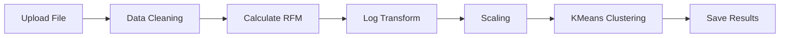

# 🎯 RFM Backend API

<div align="center">


**Sistem backend untuk analisis RFM (Recency, Frequency, Monetary) dengan Machine Learning**

[Features](#-features) • [Installation](#-installation) • [API Documentation](#-api-documentation) • [Contributing](#-contributing)

</div>

---

## 📋 Tentang Proyek

RFM Backend API adalah sistem backend berbasis Flask yang dirancang untuk melakukan analisis segmentasi pelanggan menggunakan metode RFM (Recency, Frequency, Monetary) dengan algoritma clustering KMeans. Sistem ini memungkinkan Anda untuk mengupload data transaksi, memproses analisis RFM, dan mendapatkan insight tentang segmen pelanggan secara otomatis.

## ✨ Features

- 🔐 **Autentikasi JWT** - Sistem login dan register yang aman
- 📤 **Upload File** - Support untuk CSV dan XLSX
- 🤖 **Machine Learning** - Clustering otomatis dengan KMeans
- 💾 **Database Integration** - Penyimpanan hasil analisis di MySQL
- 👤 **User Management** - Manajemen profil dan akun pengguna
- 🚀 **Auto Migration** - Script otomatis untuk setup database
- 🔒 **Protected Endpoints** - Middleware untuk keamanan API

## 🛠️ Tech Stack

| Kategori | Teknologi |
|----------|-----------|
| **Language** | Python 3.11 |
| **Framework** | Flask, Flask-CORS |
| **Database** | MySQL |
| **Data Processing** | Pandas, NumPy |
| **Machine Learning** | Scikit-learn |
| **Authentication** | JWT (PyJWT), Bcrypt |
| **Model Persistence** | Joblib |

## 📦 Installation

### 1️⃣ Clone Repository

```bash
git clone https://github.com/username/rfm-backend.git
cd rfm-backend
```

### 2️⃣ Setup Virtual Environment

```bash
# Buat virtual environment
python -m venv venv

# Aktifkan virtual environment
# Windows:
venv\Scripts\activate
# Linux/Mac:
source venv/bin/activate
```

### 3️⃣ Install Dependencies

```bash
pip install -r requirements.txt
```

### 4️⃣ Setup Environment Variables

Buat file `.env` di root directory:

```env
FLASK_ENV=development
SECRET_KEY=your_secret_key_here_change_this_in_production
DB_HOST=localhost
DB_USER=root
DB_PASS=your_password
DB_NAME=rfm_app_db
UPLOAD_DIR=uploads
MODEL_PATH=model/rfm_kmeans.model
```

> ⚠️ **Penting**: Ganti `SECRET_KEY` dengan key yang aman untuk production!

### 5️⃣ Database Migration

Jalankan script migration untuk membuat database dan tabel:

```bash
python migrate.py
```

Script ini akan membuat tabel:
- `users` - Data pengguna dan autentikasi
- `upload_history` - Riwayat file yang diupload
- `rfm_results` - Hasil analisis RFM

### 6️⃣ Jalankan Server

```bash
python app.py
```

Server akan berjalan di: **http://127.0.0.1:5000**

## 📚 API Documentation

### 🔑 Authentication Header

Untuk endpoint yang membutuhkan autentikasi, sertakan header:

```http
Authorization: Bearer <your_jwt_token>
```

---

### 🔐 Auth Endpoints

#### Register User

```http
POST /api/auth/register
Content-Type: application/json
```

**Request Body:**
```json
{
  "username": "admin",
  "email": "admin@test.com",
  "password": "admin123"
}
```

**Response:**
```json
{
  "message": "registered",
  "user_id": 1,
  "token": "eyJhbGciOiJIUzI1NiIsInR5cCI6IkpXVCJ9..."
}
```

#### Login

```http
POST /api/auth/login
Content-Type: application/json
```

**Request Body:**
```json
{
  "identifier": "admin",
  "password": "admin123"
}
```

> 💡 `identifier` bisa berupa username atau email

---

### 📤 Upload Endpoints

#### Upload File (CSV/XLSX)

```http
POST /api/upload
Authorization: Bearer <token>
Content-Type: multipart/form-data
```

**Form Data:**
- `file`: File CSV atau XLSX

**Response:**
```json
{
  "message": "file uploaded",
  "upload_id": 1,
  "filename": "Online_Retail.xlsx"
}
```

---

### 🎯 RFM Processing Endpoints

#### Process RFM Analysis

```http
POST /api/rfm/process/<file_id>
Authorization: Bearer <token>
```

**Response:**
```json
{
  "message": "RFM processing complete",
  "total_customers": 4338,
  "clusters": 5
}
```

#### Get RFM Results

```http
GET /api/rfm/results/<file_id>
Authorization: Bearer <token>
```

**Response:**
```json
[
  {
    "customer_id": "17850",
    "recency": 326,
    "frequency": 1,
    "monetary": 77183.6,
    "cluster": 2
  },
  {
    "customer_id": "12583",
    "recency": 15,
    "frequency": 45,
    "monetary": 125500.0,
    "cluster": 0
  }
]
```

---

### 👤 User Management Endpoints

#### Get Profile

```http
GET /api/user/profile
Authorization: Bearer <token>
```

#### Update Profile

```http
PUT /api/user/profile
Authorization: Bearer <token>
Content-Type: application/json
```

**Request Body:**
```json
{
  "username": "newusername",
  "email": "newemail@gmail.com"
}
```

#### Update Password

```http
PUT /api/user/profile/password
Authorization: Bearer <token>
Content-Type: application/json
```

**Request Body:**
```json
{
  "old_password": "oldpass123",
  "new_password": "newpass123"
}
```

#### Delete Account

```http
DELETE /api/user/profile
Authorization: Bearer <token>
```

## 📁 Struktur Direktori

```
rfm-backend/
│
├── 📄 app.py                    # Entry point aplikasi
├── 📄 migrate.py                # Database migration script
├── 📄 requirements.txt          # Python dependencies
├── 📄 .env                      # Environment variables
├── 📄 rfm_pipeline.py          # RFM processing pipeline
│
├── 📂 model/
│   └── 📄 rfm_kmeans.model     # Trained KMeans model
│
├── 📂 routes/
│   ├── 📄 auth.py              # Authentication routes
│   ├── 📄 upload.py            # Upload routes
│   ├── 📄 rfm.py               # RFM processing routes
│   └── 📄 user.py              # User management routes
│
├── 📂 middlewares/
│   └── 📄 auth_middleware.py   # JWT authentication middleware
│
└── 📂 uploads/                  # Uploaded files directory
```

## 📊 Cara Kerja RFM Analysis

### Metrik RFM

1. **Recency (R)**: Berapa lama sejak pembelian terakhir pelanggan
2. **Frequency (F)**: Berapa sering pelanggan melakukan pembelian
3. **Monetary (M)**: Total nilai transaksi pelanggan

### Pipeline Processing



### Data Preprocessing

- Filter data: `Quantity > 0` dan `UnitPrice > 0`
- Log transformation untuk normalisasi distribusi
- Standard scaling untuk fitur RFM
- KMeans clustering untuk segmentasi

## ⚙️ Konfigurasi

### Database Configuration

Edit file `.env` untuk mengkonfigurasi koneksi database:

```env
DB_HOST=localhost      # Host database
DB_USER=root          # Username MySQL
DB_PASS=password      # Password MySQL
DB_NAME=rfm_app_db    # Nama database
```

### Model Configuration

Model KMeans disimpan di: `model/rfm_kmeans.model`

Untuk melatih ulang model, update file `rfm_pipeline.py` dan sesuaikan parameter:
- `n_clusters`: Jumlah cluster (default: 5)
- `random_state`: Seed untuk reprodusibilitas

## 🔒 Security Notes

- ✅ Password di-hash menggunakan Bcrypt
- ✅ JWT token untuk autentikasi
- ✅ Protected endpoints dengan middleware
- ✅ Environment variables untuk kredensial sensitif
- ⚠️ Pastikan menggunakan HTTPS di production
- ⚠️ Ganti `SECRET_KEY` dengan key yang aman

## 📝 Catatan Penting

- Dataset **Online Retail** memiliki **4338 unique customers**
- Hanya customer dengan transaksi valid yang diproses
- Model KMeans menggunakan **log-transform** dan **scaling**
- Hasil cluster disimpan terkait dengan `file_id`
- Setiap user hanya bisa mengakses data mereka sendiri

## 🐛 Troubleshooting

### Error: Module not found
```bash
pip install -r requirements.txt
```

### Error: Database connection failed
- Pastikan MySQL server berjalan
- Cek kredensial di file `.env`
- Jalankan `python migrate.py` untuk setup database

### Error: JWT token invalid
- Token mungkin expired
- Login ulang untuk mendapatkan token baru

## 🤝 Contributing

Kontribusi sangat diterima! Silakan:

1. Fork repository ini
2. Buat branch baru (`git checkout -b feature/AmazingFeature`)
3. Commit perubahan (`git commit -m 'Add some AmazingFeature'`)
4. Push ke branch (`git push origin feature/AmazingFeature`)
5. Buat Pull Request

## 📘 Postman Documentation

Untuk dokumentasi lengkap API, termasuk contoh request dan response, tersedia di Postman:

Postman Workspace:
https://www.postman.com/muhamadraihanratnabadaraji2004-7590212/customer-segmentation

Anda dapat menggunakannya untuk mencoba endpoint, melihat struktur response, dan melakukan pengujian API secara langsung.

<div align="center">

**Dibuat dengan ❤️ menggunakan Flask dan Machine Learning**

[⬆ Kembali ke atas](#-rfm-backend-api)

</div>